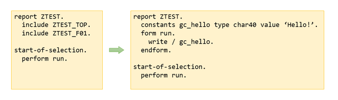

# ABAP Include Assembler #

*Version: 0.0.2*    
*[History of changes](/changelog.txt)*

## Contents ##

<!-- start toc -->

- [Synopsis](#synopsis)
- [Technical design and reuse possibilities](#technical-design-and-reuse-possibilities)
- [Installation](#installation)
- [License](#license)

<!-- end toc -->

## Synopsis ##

A tool to statically include includes into the main program. Can be useful to publish easy-to-install single-file code while still enjoying nice code structure in dev environment.

So you develop your program with as many includes as you want. Then run the include assembler and it builds you a single-file program which you publish then.

The result can be saved to a file or to **another program** or just shown on screen. "Another program" remains inactive after update. 

## Technical design and reuse possibilities ##

Internal structure is designed so that it can be **integrated in another software as a middleware** (for those who might be interested).

Briefly, you call `lcl_code_object=>load()` with a program name to assemble. This creates a memory copy of program code with all includes as a deep list. Then you create `lcl_assembler` instance with a reference to the above code object and call `assemble()` - it returns `abaptxt255` table with the assembled code. See `lcl_main-run()` for code example.

Integration aspect: `lcl_code_object=>load()` also requires an instance of `lif_devobj_accessor` - an interface implementation that supplies program code by it's name. In the include_assembler it is implemented in `lcl_extractor` class - it actually reads program code from system. But you are free to implement your own class with another approach (e.g. of your code already has extraction logic). Example can be seen in `lcl_dummy_extractor` - the dummy class used for testing, it doesn't read objects from system but generates them.

## Installation ##

This code synced with Github and can be installed with [AbapGit](https://github.com/larshp/abapGit). 
Alternatively just copy `zinclude_assembler.abap` code to a new program.

## License ##

The code is licensed under MIT License. Please see [LICENSE](/LICENSE) for details.

