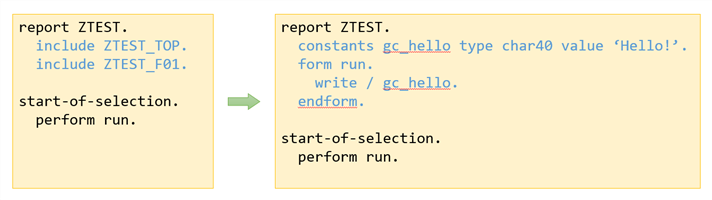
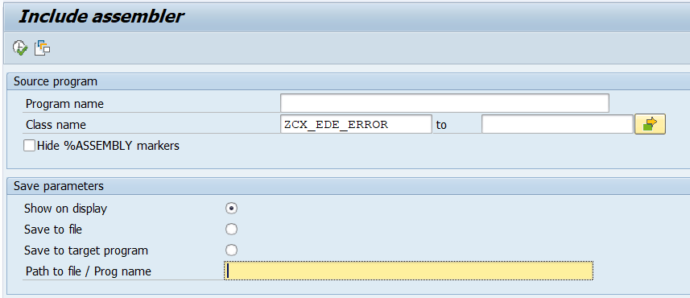

# ABAP Include Assembler

*Version: 0.1.0*
*[History of changes](/changelog.txt)*

## Contents

<!-- start toc -->

- [Synopsis](#synopsis)
- [Technical design and reuse possibilities](#technical-design-and-reuse-possibilities)
- [Installation](#installation)
- [License](#license)

<!-- end toc -->

## Synopsis

A tool to statically include includes, interfaces and classes into the main program. Can be useful to publish easy-to-install single-file code while still enjoying nice code structure in dev environment.

You develop your program with as many includes/classes as you want. Then run the include assembler and it builds you a single-file program which you publish or deploy.

The result can be saved to a file or to **another program** or just shown on screen. "Another program" remains inactive after update. Only includes from the same dev-package as the main program are assembled.

The tool also supports **classes and interfaces** (with local definitions/implementations and macros). You can specify multiple of those. The order or serialization will be automatically detected (dependency related).

## Installation

Installed with [AbapGit](https://github.com/abapGit/abapGit).

## License and attribution

- The code is licensed under MIT License. Please see [LICENSE](/LICENSE) for details.
- The code reuses fragments of [abapGit](https://github.com/abapGit/abapGit) code
